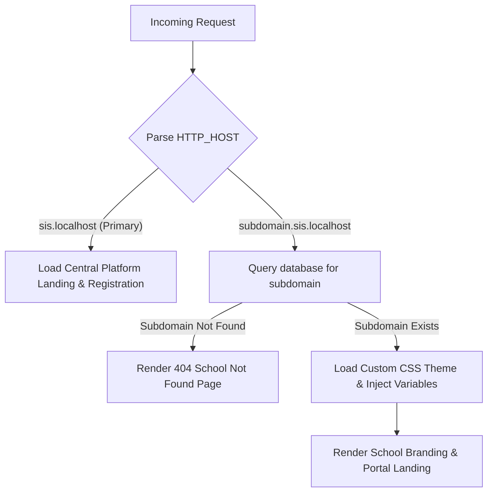

# SIS SaaS Multi-Tenant Platform

A comprehensive, enterprise-ready multi-tenant Software as a Service (SaaS) School Management System designed specifically for scalable academic operations. This platform enables administrators to instantly deploy custom educational portals under dedicated subdomains, boasting robust role-based academic workflows, custom dynamic styling via structural themes, real-time message exchange, and grade evaluation analytics.

---

## 🌟 Key Capabilities

### 1. Zero-Footprint Multi-Tenant Routing
Uses dynamic wildcard subdomain mapping (e.g., `schoolname.sis.localhost` or `goldenacademy.sis.localhost`). All school domains are resolved on the fly from a single central codebase and database instance, eliminating the need to duplicate folders or install separate code instances.

### 2. Live Page Builder & Dynamic Styling Injection
- **Structural Templates**: Schools choose from premium pre-built layouts: *Academic* (traditional, structured), *Blank* (modern bento-grid), *Minimalist* (Apple-inspired), and *Vibrant* (energetic, high contrast).
- **CSS Variable Injection**: System reads customized primary colors, typography choices, and configurations directly from the database and injects them live into CSS custom variables (`var(--primary)`, `var(--bg-color)`), adapting the UI instantly.
- **Admin Page Override**: Offers a secure, database-persisted visual page builder that allows school directors to inject customized HTML segments into key landing routes.

### 3. Integrated Academic Suite & Role-Based Access Control (RBAC)
- **Granular Isolation**: Database constraints filter and isolate student, teacher, class, and parent records strictly based on the resolved `school_id`.
- **Grade & Assessment Engine**: Allows teachers to set customized grading weightings (continuous assessment, final exam) and dynamically calculates averages, class rankings, and academic pass/fail decisions.
- **Bulk CSV Engine**: Simplifies school boarding with high-volume uploads for student and teacher registrations.
- **Inter-Role Communication**: In-app secure communication channel for instant message routing between teachers, parents, and school directors.

---

## 📂 Project Architecture

```directory
├── public/                 # Web server root and routing entry point
│   ├── .htaccess           # URL rewriting rules for clean API and page routes
│   ├── index.php           # Core subdomain interceptor and portal bootstrapper
│   ├── landing.php         # Platform central marketing/registration landing page
│   ├── dashboard.html      # Unified administration dashboard client
│   ├── auth/               # Web client authentication views
│   └── assets/             # Core themes, custom scripts, fonts, and images
├── src/                    # PSR-compliant backend PHP source code
│   ├── Config/             # Environment, Database class, and Migrations scripts
│   ├── Controllers/        # Business logic handlers (Auth, Grading, CSV, Pages)
│   ├── Models/             # Database access entities and Active Record models
│   └── Services/           # Shared domain-logic modules (ID Generator, pass-fail)
├── templates/              # Dynamic UI views injected with school-level branding
└── sql/                    # SQL Database structure and schema files
```

---

## 🛠️ Developer Setup (Local XAMPP on Windows)

Follow this setup guide to initialize the platform locally using native XAMPP without containers.

### 1. Virtual Hosts & Hostname Resolution
To enable the multi-tenant routing, you must map the central domain (`sis.localhost`) and wildcard subdomains to your localhost.

#### Windows `hosts` Configuration:
    *(We used the local .localhost domain which is by default configured with 127.0.0.1 )*
    *(Why we did this is to mimic the actual deployment environment to test it locally and handle the subdomain routing. Skiping this section is possible but the virtual host configuration is neccessary )*
1. Open your text editor (e.g., Notepad) as **Administrator**.
2. Open the file: `C:\Windows\System32\drivers\etc\hosts`
3. Append the following lines at the bottom:
   ```hosts
   127.0.0.1    sis.localhost
   127.0.0.1    vibrant.sis.localhost
   127.0.0.1    academic.sis.localhost
   ```
   *(Note: Add any additional custom school subdomains you create to this file).*

#### Apache Virtual Host Configuration (`httpd-vhosts.conf`):
    *(Make the domain sis.localhost point to the source code to be executed)*
1. Open your XAMPP Apache configuration: `C:\xampp\apache\conf\extra\httpd-vhosts.conf`
2. Add a virtual host that captures all requests for `sis.localhost` and wildcard subdomains, pointing their document root directly to the project's `/public` folder:
   ```apache
   <VirtualHost *:80>
       ServerAdmin admin@sis.localhost
       DocumentRoot "C:/xampp/htdocs/school-management-system/public"
       ServerName sis.localhost
       ServerAlias *.sis.localhost
       
       <Directory "C:/xampp/htdocs/school-management-system/public">
           Options Indexes FollowSymLinks MultiViews
           AllowOverride All
           Require all granted
       </Directory>
       
       ErrorLog "logs/sis.localhost-error.log"
       CustomLog "logs/sis.localhost-access.log" combined
   </VirtualHost>
   ```
3. Restart Apache via the **XAMPP Control Panel**.

### 2. Database Connection
Configure your local environment database credentials:
1. Open [src/Config/Database.php](file:///c:/xampp/htdocs/school-management-system/src/Config/Database.php).
2. Review or update connection parameters to match your XAMPP MySQL credentials:
   ```php
   private $host = "localhost";
   private $db_name = "school_system";
   private $username = "root";
   private $password = ""; // Standard XAMPP default is blank
   ```

---

## ⚙️ Core Architecture & Routing Details

### Dynamic Subdomain Resolution Flow
Every HTTP request goes through `public/index.php`. The router parses the request and matches the tenant subdomain:



### CSS Styling Injection Mechanism
1. The platform resolves the active school via the subdomain query.
2. It fetches styling parameters from the `school_site_content` table (including `primary_color`, `typography`, and `template_name`).
3. During template rendering, the system dynamically outputs custom CSS properties in the `<head>` tag:
   ```html
   <style>
       :root {
           --primary-color: <?php echo $siteContent['primary_color']; ?>;
           --font-family: '<?php echo $siteContent['typography']; ?>', sans-serif;
       }
   </style>
   ```
4. Standard components use these custom variables, adapting their color schemes instantly without server-side compile steps.

---

## 🧪 Tester's Verification Guide

This guide is designed for quality assurance testers to import testing data and systematically verify platform features.

### 1. Database Setup for Testers
To ensure the test suite executes with predefined roles and system scenarios:
1. Open **phpMyAdmin** (`http://localhost/phpmyadmin`) or use your MySQL CLI tool.
2. Create a database named `school_system`.
3. Locate the SQL dump file provided by the team or user.
4. Go to phpMyAdmin's **Import** tab, choose the database backup file, and click **Import**.
5. Alternatively, run the following import command in your terminal:
   ```bash
   mysql -u root -p school_system < path/to/your/provided/database_file.sql
   ```

### 2. Manual Test Workflows & Verification

Once your database is imported and Apache is restarted, perform the following validation sequences:

#### Test Flow A: Central Platform & Registration
1. Navigate to the primary URL: `http://sis.localhost`
2. **Verify**: The marketing landing page loads showing product features and pricing plans.
3. Click on the registration action and register a new school (e.g., subdomain: `academic`).
4. **Verify**: Registration completes successfully and redirect works.

#### Test Flow B: Multi-Tenant Subdomain Validation
1. Navigate to the custom tenant landing page (e.g., `http://academic.sis.localhost` or `http://vibrant.sis.localhost`).
2. **Verify**: The system maps the school and renders its unique template (Vibrant, Minimalist, Academic, etc.) complete with custom color themes.
3. Attempt to access a non-existent subdomain, e.g., `http://fake.sis.localhost`.
4. **Verify**: The system catches the exception and renders the user-friendly **404 School Not Found** page.

#### Test Flow C: Academic & Grading Module (Teacher & Student Role)
1. **Login as Teacher**: Navigate to `http://[subdomain].sis.localhost/auth/login.html` and sign in.
2. Select an active **Section / Grade** and open the **Grades Sheet** or **Continuous Assessments** module.
3. Input or modify grades for a student (e.g., change test scores out of 50). Click **Save**.
4. **Login as Student/Parent**: In an incognito window, log into the same tenant subdomain as a Student or Parent.
5. Navigate to the **Report Card** or **Academic Profile** section.
6. **Verify**: The updated marks, continuous assessment weights, GPA calculations, and class rank update instantly in real-time according to the teacher's input.

#### Test Flow D: System Communications (Parent & Teacher Direct Messaging)
1. **Login as Parent**: Go to the portal and log in with your parent account.
2. Navigate to the **Communications / Messages** panel. Click **New Message**, select the teacher's name from the recipient list, write a message, and send.
3. **Login as Teacher**: Access the teacher dashboard on the same school domain.
4. Open the **Communications** tab.
5. **Verify**: The sent parent message appears immediately inside the inbox. Test replying to verify bidirectional transmission.

#### Test Flow E: Page Builder Verification
1. **Login as Director**: Log into the director portal at `http://sis.localhost`.
2. Access the **Visual Page Builder** tab.
3. Modify the Hero text, change the theme configuration color using the color picker, and save changes.
4. **Verify**: Navigate to the public page (`http://sis.localhost`) and confirm styling updates are reflected immediately.

---

## 🚀 High-Performance Production Tuning

For scalable production deployments outside local environments:

1. **OPcache Optimization**: Enable PHP's OPcache in `php.ini` to store precompiled PHP byte-code in shared memory, eliminating continuous script compilation overhead.
2. **Database Indices**: Ensure indices exist on the `subdomain` column in the `schools` table and the foreign key fields (`school_id`, `student_id`) to maintain microsecond retrieval times as transaction size increases.
3. **Static Caching Layer**: Offload high-traffic styling assets, scripts, and fonts to a global CDN (e.g., Cloudflare) to minimize local server resource consumption.
